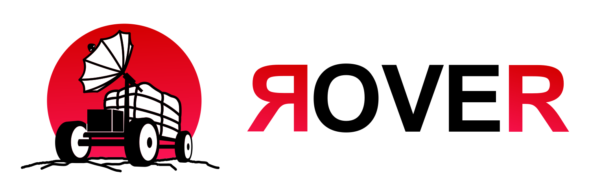

# Rover 
Build mobile apps with the best interpreted language ever Lua #BrazilMentioned

# Demo


# Example
```lua
function rover.run()
    return rover.view {
        height = "100",
        width = "full",
        color = "#0000ff",
        rover.text {
            "Hello Rover",
        }
    }
end
```

# The goals
- [x] the goal is to be able to make at least a View with a text inside, using lua table to design views
- [x] at least a cold reload
- [ ] setup a state using signals architecture

# How i plan to do that?


Since lua is an embeded language, my goal is to embed lua scripts to be reuse by android and ios platforms.
To make it happen, i intent to use rust as a bridge, so lua scripts are interpreted with rust, and rust compile that to use in native codes


# How to use this repo 

## Before starting make sure you have
- cargo intalled

## How to build rover for testing

the repo is devided in some modules, 
we have the rover gear, and the cli

starting with gears 

cd src/gears
rustup default stable
./setup

this will prepar the base for the env, now lets build and test android

first of all make sure to have ANDROID_NDK_HOME setted

in macos it's somethins like
~/Library/Android/sdk/ndk/23.1.7779620

this is required because it needs ANDROID NDK to comunicate with android

cargo install cargo-ndk

cargo build --features android

things to keep in mind

building android we can't do that with the objc crate

you can chet with git status that if everything went well, the .so files changes inside the roverandroid folder

open the template/android on android studio

and run the app

in the current state it only runs with the dev_server, we still need to put it to run together, BUT for now, 

cd src/rover-cli
cargo build --release
cp target/release/rover ~/.local/bin/

go back to root of project, then go to template

cd ../../template
rover run

rereun the app and then it will shows what is beeing rendered


